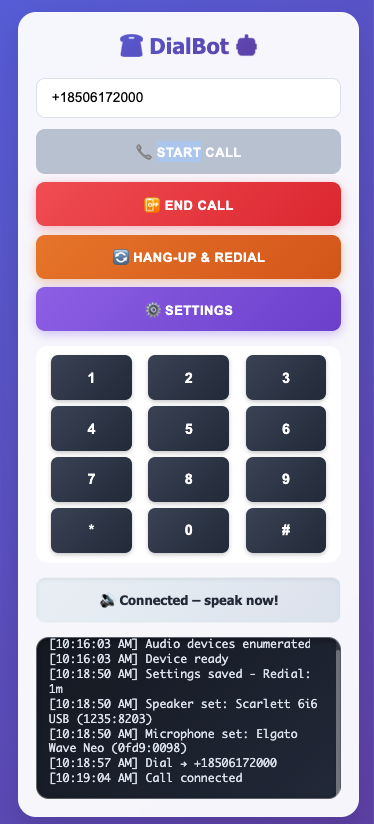
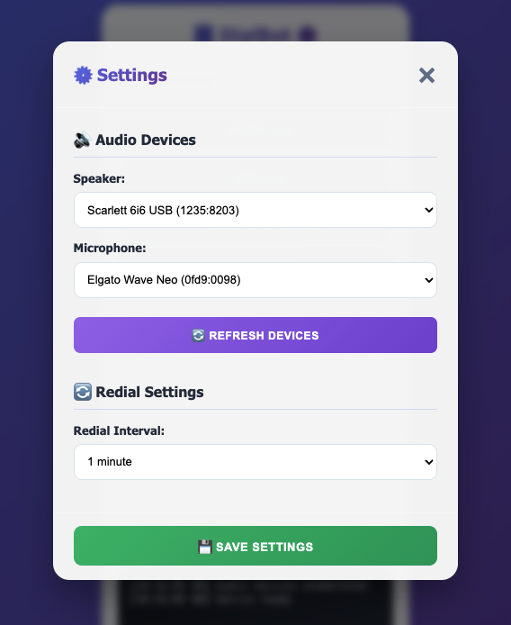
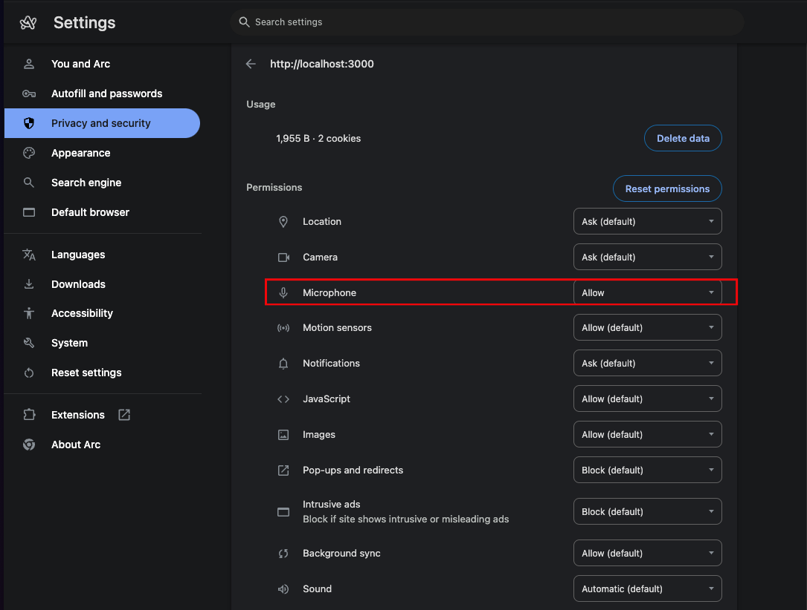

# Twilio Dialbot

A minimal browser‑to‑PSTN dialer built with **Twilio Client SDK v1.13** and Node.js. One click places a call, bridges audio back to your browser, lets you navigate phone menus with a keypad, auto‑redials, and records only the calls that were answered by a human.
Works with built in speaker \ mic or external audio devices.




---

## 📑 Table of Contents

1. [Features](#features)
2. [Requirements](#requirements)
3. [Environment Variables](#environment-variables)
4. [Quick Start](#quick-start)
5. [Usage](#usage)
6. [Troubleshooting](#troubleshooting)
7. [Call Recording](#call-recording)
8. [Twilio Setup Checklist](#twilio-setup-checklist)
9. [Folder Structure](#folder-structure)

---

### Features

* ✅ One‑click outbound call from browser
* ✅ Automatic bridge when callee answers (no ringtone audible to them)
* ✅ 12‑button DTMF keypad (0‑9 \* #)
* ✅ Hang‑up & Redial loop (delay configurable)
* ✅ Live log panel: dial attempts, redials, DTMF, status
* ✅ Mono call recording **from answer only**; voicemail/short calls auto‑deleted
* ✅ **Audio device selection** for external interfaces and USB microphones

---

### Requirements

| Item                        | Notes                                               |
| --------------------------- | --------------------------------------------------- |
| **Twilio account**          | Free account works; must have Voice‑enabled phone # |
| **Twilio phone number**     | Buy or port one from Console → Phone Numbers        |
| **Node ≥ 18**               | Local server & token generator                      |
| **ngrok** (or other tunnel) | Exposes `localhost:3000` to Twilio webhooks (HTTPS) |

> For production deploy the server to Render / Fly / Heroku and drop ngrok.

---

### Environment Variables
Create `.env` in project root:

```ini
# Twilio creds
TWILIO_ACCOUNT_SID=xxxxxxxxxxxxxxxxxxxxxxxxxxxxxxxxxx # https://console.twilio.com/ ➜ Account SID
TWILIO_AUTH_TOKEN=xxxxxxxxxxxxxxxxxxxxxxxxxxxxxxxxx # https://console.twilio.com/ ➜ Auth Token
TWILIO_API_KEY_SID=xxxxxxxxxxxxxxxxxxxxxxxxxxxxxxxxxx # Create from https://console.twilio.com/ ➜ API keys
TWILIO_API_KEY_SECRET=xxxxxxxxxxxxxxxxxxxxxxxxxxxxxxxx # Create from https://console.twilio.com/ ➜ API keys
TWILIO_NUMBER=+1xxxxxxxxxx # Your phone number in Twillio
TWIML_APP_SID=xxxxxxxxxxxxxxxxxxxxxxxxxxxxxxxxxx

# Server
SERVER_URL=https://xxxx-xx-xxx-xxx-xxx.ngrok-free.app
PORT=3000

# Dialbot behaviour
REDIAL_DELAY_MS=60000      # 1 minute (change as needed)
NUMBER_TO_CALL= +1xxxxxxxxxx # pre-fill number
```

---

### Quick Start

```bash
# 1 Clone & install
git clone https://github.com/<you>/twilio-dialbot
cd twilio-dialbot
npm install

# 2 Create .env → fill creds
cp .env.example .env

# 3 Run server
node server.js    # on port 3000

# 4 Expose to Twilio
ngrok http 3000   # copy HTTPS → SERVER_URL in .env

# 5 Open UI
open https://<ngrok-id>.ngrok-free.app
```

---

### Usage

1. **Grant microphone permissions** when prompted (required for audio device enumeration)
2. **Select your audio devices** from the dropdown menus:
   - Choose your speaker/audio interface from the 🔊 **Speaker** dropdown
   - Choose your microphone/USB mic from the 🎤 **Microphone** dropdown
3. Type the destination number (`+1…`) → **Call** (button only enables after device selection)
4. Once connected, status changes to *Connected – speak!*
5. Use **keypad** for IVRs
6. **Hang‑up & Redial** ends the call and retries after the delay

---

### Troubleshooting

#### Audio Device Issues

If you're using external audio devices (audio interfaces, USB microphones, etc.), you may need to explicitly grant microphone permissions to your browser:



**Steps to fix:**
1. Go to your browser settings (Chrome: `chrome://settings/content/microphone`)
2. Find your localhost site (e.g., `http://localhost:3000`)
3. Set **Microphone** permission to **"Allow"**
4. Refresh the page and click **🔄 Refresh Devices** if needed

**Common symptoms:**
- Empty device dropdowns
- "Device enumeration error" in logs  
- "Unable to set audio output devices" warnings
- AudioContext errors

The app requires microphone access to enumerate and select your specific audio devices, especially when using professional audio interfaces that don't appear as "default" system devices.

---

### Call Recording

| Fact       | Value                                            |
| ---------- | ------------------------------------------------ |
| Mode       | `record-from-answer` (mono)                      |
| Cost       | Call \$0.014 / min   +  Recording \$0.0025 / min |
| Storage    | First 10 000 min free, then \$0.0005 / min·month |
| Auto‑prune | Voicemail or <30 s calls deleted by webhook      |

Access recordings from  https://console.twilio.com/us1/monitor/logs/call-recordings?frameUrl=/console/voice/recordings/recording-logs?x-target-region=us1

> **Tip:** If you need to keep everything, remove the deletion logic in `server.js`.

---

### Twilio Setup Checklist

1. **Sign in** at [https://console.twilio.com/](https://console.twilio.com/).
2. **Buy a Voice number** (Console → Phone Numbers → *Buy*).
3. **Create API Key** (Console → Account → API Keys → *Create standard key*).
4. **Copy** SID / Auth Token / Key SID / Key Secret into `.env`.
5. **Run ngrok** and set `SERVER_URL`.
6. Done – no console webhooks needed; Dialbot supplies `/twiml` & `/call-status` dynamically.

---

### Folder Structure

```
server.js            # Express API + Twilio logic
public/
  └─ index.html      # UI – dialer, keypad, log
  └─ styles.css      # UI – CSS styling
  └─ troubleshoot.png # Browser permissions screenshot
```
