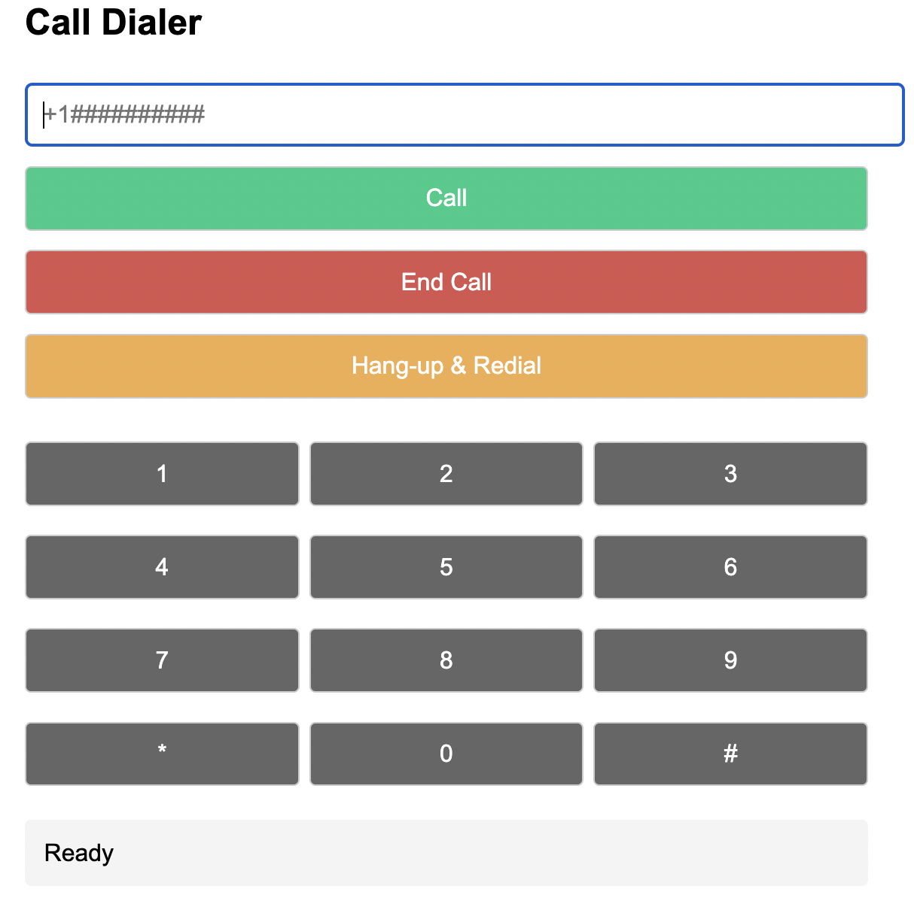

# Twilio Dialbot

Browser-to-phone bridge built with Twilio Client SDK v1.13 and Node.js.

## Features

- ✅ One-click call from browser → PSTN
- ✅ Automatic bridge back to the browser when the callee answers
- ✅ Zero ringtone in the browser (`sounds: false`)
- ✅ End-call button and live status display
- ✅ 12-button DTMF keypad (0-9, *, #) for phone-tree navigation
- ✅ **Hang-up & Redial** - Automatically redials after configurable delay
- ✅ Minimal code: single `server.js` + `public/index.html`




## Environment Variables

Create a `.env` file with the following variables:

```ini
# Twilio Account Credentials
TWILIO_ACCOUNT_SID=xxxxxxxxxxxxxxxxxxxxxxxxxxxxxxxxxx # https://console.twilio.com/ ➜ Account SID
TWILIO_AUTH_TOKEN=xxxxxxxxxxxxxxxxxxxxxxxxxxxxxxxxxx # https://console.twilio.com/ ➜ Auth Token

# Twilio API Keys (for generating access tokens)
TWILIO_API_KEY_SID=xxxxxxxxxxxxxxxxxxxxxxxxxxxxxxxxxx # Create from https://console.twilio.com/ ➜ API keys
TWILIO_API_KEY_SECRET=xxxxxxxxxxxxxxxxxxxxxxxxxxxxxxxx

# Twilio Phone Numbers and Apps
TWILIO_NUMBER=+1xxxxxxxxxx                           # Your Twilio phone number
TWIML_APP_SID=AP37xxxxxxxxxxxxxxxxxxxxxxxxxxxxxxxx   # Create TwiML App from https://console.twilio.com/ ➜ Phone Numbers ➜ Manage ➜ TwiML Apps

# Server Configuration
SERVER_URL=https://xxx-xx-xxx-xxx-xxx.ngrok-free.app # Your public HTTPS URL (ngrok, etc.)
PORT=3000                                            # Local server port (optional, defaults to 3000)

# Default Number (optional)
NUMBER_TO_CALL=+1xxxxxxxxxx                         # Pre-fill phone number field (optional)

# Redial Configuration
REDIAL_DELAY_MS=60000                                # Auto-redial delay in milliseconds (60000 = 1 minute)
```

## Quick Start

```bash
# 1. Clone and install
git clone https://github.com/your-user/twilio-dial-bridge.git
cd twilio-dial-bridge
npm install

# 2. Create .env
cp .env.example .env            # then edit with your credentials

# 3. Run locally
node server.js                  # default port 3000

# 4. Expose to the internet (ngrok or similar)
ngrok http 3000                 # copy the HTTPS URL into SERVER_URL in .env

# 5. Open the app
open https://<your-ngrok>.ngrok-free.app
```

## Usage

1. Enter a phone number in E.164 format (`+1…`) and press **Call**
2. When the call connects, the page shows "Connected – speak!"
3. Use the **DTMF keypad** to send menu options (0-9, *, #)
4. Press **End Call** to hang up manually
5. Use **Hang-up & Redial** to automatically hang up and redial after the configured delay (see `REDIAL_DELAY_MS`)

## Folder Structure

```
server.js            # Express server: /token, /call, /twiml, /end-call
public/
  └── index.html     # Front-end UI and Twilio Client logic
.env.example         # Sample environment file
README.md            # This file
```

## Setup Notes

- **TwiML App**: Create a new TwiML App in your Twilio Console and set the webhook URL to `{SERVER_URL}/twiml?client=browserUser`
- **ngrok**: Use `ngrok http 3000` to expose your local server to the internet for Twilio webhooks
- **HTTPS Required**: Twilio requires HTTPS for webhooks and WebRTC functionality
- **Redial Timing**: Adjust `REDIAL_DELAY_MS` to control how long to wait before automatically redialing (default: 60 seconds)